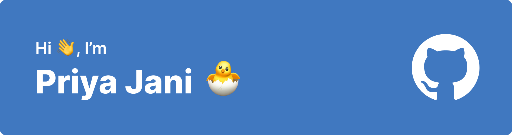

<!--  -->

<h1 align="left">Hey 👋 What's up?</h1>

###

I'm Priya Jani, a web developer, from Gandhinagar, Gujarat.

###

<!--  -->

<h2> 👨🏻‍💻 About Me </h2>

- 🎓 I’m currently in my final year of BTech CSE @ Ahmedabad University.
- 👀 I’m interested in becoming a Software Engineer.
- 📚 I'm currently learning web technologies and sometimes get curiosity in ML/AI .
- 🎯 Goals: Creating my portfolio, ideating some projects and yes, learning new things each day.
- 🎲 Fun fact: My ideas can go wild. I dance in my own room. I eat a lot while working (munching chips quietly right now).

<h3>🛠 Tech Stack</h3>

<!-- <h1 align="left">Hey 👋 What's up?</h1>

###

I'm Priya Jani, a web developer, from Gandhinagar, Gujarat.

###

<h2 align="left">About me</h2>

###

 

✨ Creating bugs since 2020 📚 I'm currently learning web technologies and sometimes get curiosity in ML/AI . 🎯 Goals: Creating my portfolio, ideating some projects and yes, learning new things each day. 🎲 Fun fact: My ideas can go wild. I dance in my own room. I eat a lot while working (munching chips quietly right now).

-->

<!--
###

<h2 align="left">⚔️ My Technical Skill Set</h2>

###

Languages

###

  
  
  
  
  
  
  
  
  
  
  
  
  
  
  
  
  
  
  

###

Framework and Libraries

###

 

Frontend

###

  
  
  
  
  
  
  
  
  

###

Backend

###

  
  
  
  
  

###

Database

###

  
  
  

###

Cloud

###

  
  
  

###

IDEs/Editors

###

  
  
  

###

OS & Version Control

###

  
  
  
  
  
  
  

###

I am also at

###

Let's Connect

###

--!

<!--
### Hi there 👋

**priyajani028/priyajani028** is a ✨ _special_ ✨ repository because its `README.md` (this file) appears on your GitHub profile.

Here are some ideas to get you started:

- 🔭 I’m currently working on ...
- 🌱 I’m currently learning ...
- 👯 I’m looking to collaborate on ...
- 🤔 I’m looking for help with ...
- 💬 Ask me about ...
- 📫 How to reach me: ...
- 😄 Pronouns: ...
- ⚡ Fun fact: ...
-->
